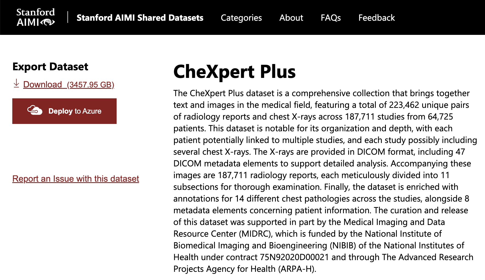

# CXR Data Ingest

This repository contains utilities for ingesting chest X-rays, their corresponding text reports, and preprocessing data samples for downstream modeling use. The 2 primary datasets are MIMIC-CXR and CheXpert Plus.

* MIMIC-CXR: https://physionet.org/content/mimic-cxr-jpg/2.1.0/
* CheXpert Plus: https://aimi.stanford.edu/datasets/chexpert-plus

### TODO

* add labeling details

### Prerequisites

* Account credentialing and training on physionet: https://www.physionet.org/settings/credentialing/
* Account on StanfordAIMI: https://stanfordaimi.azurewebsites.net/
* Docker for running chexpert labeler
* Python dependencies specified in requirements.txt

## Table of Contents
1. [MIMIC-CXR](#mimic-cxr)
1. [CheXpert Plus](#chexpert-plus)
1. [Labeling](#labeling)

## MIMIC-CXR

**NB**: the labels provided by the MIMIC-CXR authors are derived over a mixture of report sections. As noted in the original MIMIC-CXR publication (https://arxiv.org/pdf/1901.07042):

> Labels for the images were derived from either the impression section, the findings section (if impression was not present), or the final section of the report (if neither impression nor findings sections were present).

This makes experimentation over separate report sections difficult, as labels may not be derived over the section of interest. To resolve this, we section the reports and rederive labels over distinct report sections. Further, the provided labels are using the original CheXpert labeler rather than its updated version, CheXbert. We relabel using both variants for flexible downstream experimentation.

### To prepare the dataset:

1. Download MIMIC-CXR-JPG: https://physionet.org/content/mimic-cxr-jpg/2.1.0/. This may take a few days if using `wget`.
1. Cleanup folder structure.
    <details>
    <summary>Expand to show the expected file structure for this step</summary>

    ```
    mimic-cxr
    ├── files
    │   └── [...]
    ├── IMAGE_FILENAMES
    ├── LICENSE.txt
    ├── README
    ├── SHA256SUMS.txt
    ├── mimic-cxr-2.0.0-chexpert.csv.gz
    ├── mimic-cxr-2.0.0-metadata.csv.gz
    ├── mimic-cxr-2.0.0-negbio.csv.gz
    ├── mimic-cxr-2.0.0-split.csv.gz
    └── mimic-cxr-2.1.0-test-set-labeled.csv
    ```
    </details>
1. Download the notes from MIMIC-CXR. Rather than download all of MIMIC-CXR which has all of the original `.dcm` files, we can get just the notes:
    ```bash
    wget -r -N -c -np --user <USER> --ask-password https://physionet.org/files/mimic-cxr/2.1.0/mimic-cxr-reports.zip
    ```
1. Unzip the downloaded reports.
    1. Move `mimic-cxr-reports.zip` to the `mimic-cxr` directory. This will result in the notes being unzipped alongside the jpgs. :
        <details>
        <summary>The folder <b>before</b> unzipping should look like this</summary>

        ```
        mimic-cxr
        ├── files
        │   └── [...]
        ├── IMAGE_FILENAMES
        ├── LICENSE.txt
        ├── README
        ├── SHA256SUMS.txt
        ├── mimic-cxr-2.0.0-chexpert.csv
        ├── mimic-cxr-2.0.0-metadata.csv
        ├── mimic-cxr-2.0.0-negbio.csv
        ├── mimic-cxr-2.0.0-split.csv
        ├── mimic-cxr-2.1.0-test-set-labeled.csv
        └── mimic-cxr-reports.zip
        ```
        </details>
    1. Unzip the reports:
        ```bash
        unzip mimic-cxr-reports.zip
        ```
        <details>
        <summary>The folder <b>after</b> unzipping should look like this</summary>

        ```
        mimic-cxr
        ├── files
        │   └── [...]
        ├── IMAGE_FILENAMES
        ├── LICENSE.txt
        ├── README
        ├── SHA256SUMS.txt
        ├── mimic-cxr-2.0.0-chexpert.csv
        ├── mimic-cxr-2.0.0-metadata.csv
        ├── mimic-cxr-2.0.0-negbio.csv
        ├── mimic-cxr-2.0.0-split.csv
        ├── mimic-cxr-2.1.0-test-set-labeled.csv
        ├── mimic-cxr-reports.zip
        └── notes
            └── [...]
        ```
        </details>
1. Extract note sections:
    ```bash
    python 1_create_section_files.py \
    --reports_path /path/to/mimic-cxr/notes \
    --output_path /path/to/mimic-cxr
    ```
    This will create 2 files in `mimic-cxr`:
    * `mimic_cxr_sectioned.csv` - contains individual report sections for findings, impression, comparison, and the last paragraph.
    * `mimic_cxr_selected_section.csv` - single selected section per report, per the method described by the MIMIC-CXR authors.

## CheXpert Plus

**NB**: while CheXpert Plus ships with labels using the updated CheXbert labeler and further provides separate labels per sections, there are subtle errors in the labels that arise from specific preprocessing steps by the CheXpert Plus authors. See this GitHub issue for more details: https://github.com/Stanford-AIMI/chexpert-plus/issues/13. As a result, we apply further custom preprocessing to address this and other issues, detailed below.

Apologies this section is not as detailed with precise commands, however we outline the steps as follows:

### To prepare the dataset:
1. Download CheXpert Plus: https://stanfordaimi.azurewebsites.net/datasets/5158c524-d3ab-4e02-96e9-6ee9efc110a1
    * We recommend accessing this page using Google Chrome as we've observed not all browsers seem compatible.
    * We strongly recommend using `azcopy` or other CLI tool for downloading data from Microsoft Azure. You can get a signed download link to use with `azcopy` after logging in and clicking the "Download" link under the "Export Dataset" header on the left sidebar of the page.

        <details>
        <summary>Here's a screenshot of the download page</summary>

        
        <details>
    * For our purposes, we do not need the original DICOMs. Use `azcopy` flags to exlude the download of files under the DICOM path. This makes the download approximately 80% smaller!
1. Unzip the chunked PNGs. Make sure to unzip the chunks into the same directory so that the files are extracted alongside each other. This should create a parent directory `PNG` with two subdirectories `train` and `valid`.
1. Run the cells in `2_prepare_chexpertplus_metadata.ipynb`. This notebook does the following important preprocessing steps:
    * Derive globally unique study IDs, as in MIMIC-CXR.
    * Extract and deduplicate report sections.
    * Derive new validation set and treat provided validation set as test set. Rename splits in same manner as MIMIC-CXR.
    * We do not convert this notebook into a script to enable interactive inspection and altering for your specific needs.
    * 3 new files should be created, `split.csv`, `metadata.csv`, and `report.csv`.

## Labeling

## References
1. `create_section_files.py` and `section_parser.py` modified from https://doi.org/10.5281/zenodo.2591653
